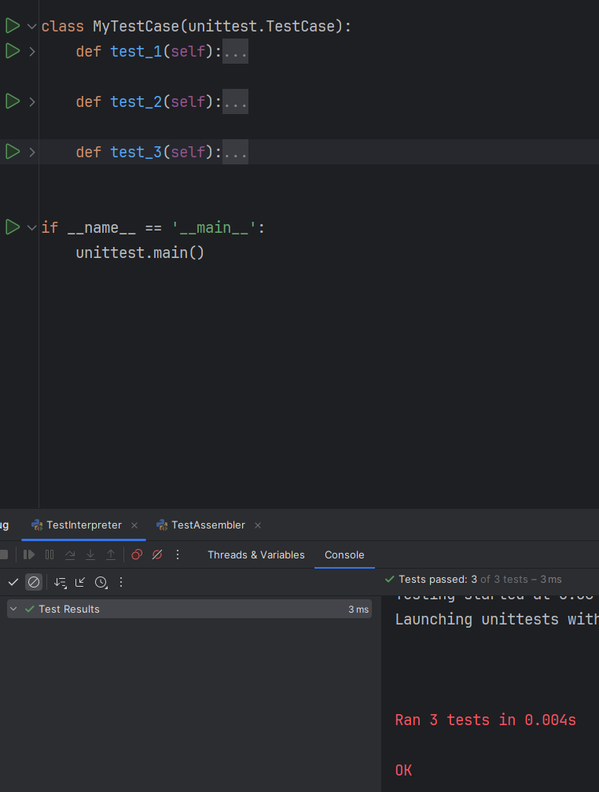
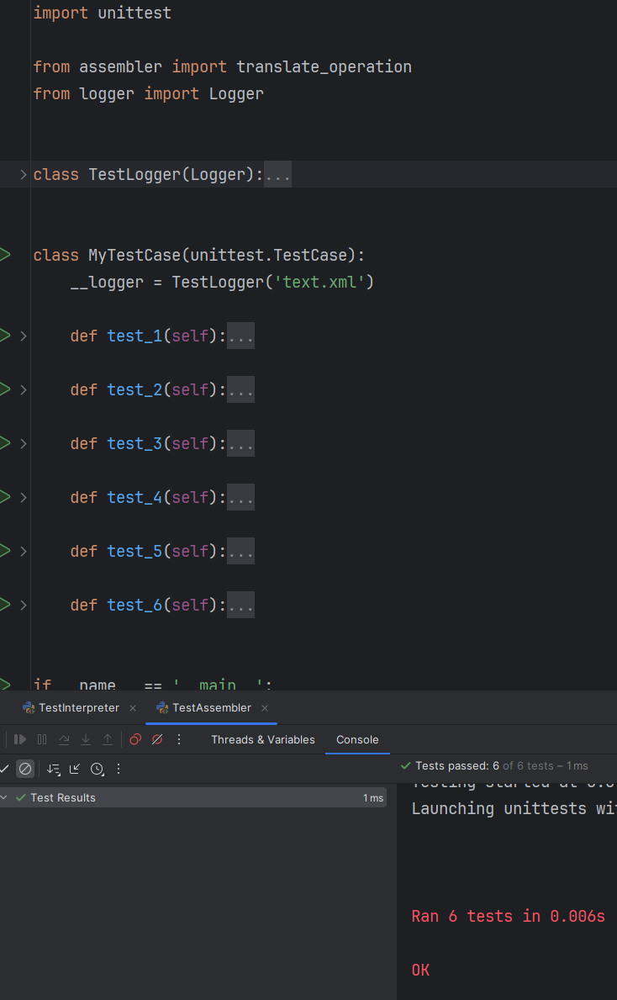

### Общее описание работы
Разработать ассемблер и интерпретатор для учебной виртуальной машины
(УВМ).

### Используемые модули и язык программирования
Использую язык программирования Python версии 3.10<br>
<br>
В качестве пакетов, импортируемых в программу, использую:
1. re - для работы с регулярными выражениями
2. argparse - для работы с аргументами командной строки
3. xml.etree.ElementTree - для работы с xml файлами
4. io.UnsupportedOperation - для выбрасывания исключения

### При запуске ассемблера необходимо указать:
1. Путь до файла с заданной программой
2. Путь сохраняемого файла результата работы
3. Путь файла логов

### При запуске интерпретатора необходимо указать:
1. Путь до файла с заданной программой
2. Путь сохраняемого файла результата работы
3. Начальный адрес памяти для вывода
4. Конечный адрес памяти для вывода

### Пример запуска ассемблера:
```
python assembler.py -i example.ass -o input.bin -l logs.xml
```
_Входной файл тестовой программы:_
```
LOAD 105
WRITE 11

LOAD 9392
WRITE 12

LOAD 3890
WRITE 13

LOAD 1754
WRITE 14

LOAD 6971
WRITE 15
// ------------------------
LOAD 7411
WRITE 101

LOAD 5298
WRITE 102

LOAD 9170
WRITE 103

LOAD 4794
WRITE 104

LOAD 6761
WRITE 105
// -------------------------
LOAD 11
READ
LEQ 101
WRITE 201

LOAD 12
READ
LEQ 102
WRITE 202

LOAD 13
READ
LEQ 103
WRITE 203

LOAD 14
READ
LEQ 104
WRITE 204

LOAD 15
READ
LEQ 105
WRITE 205
```
_Выходной бинарный файл_<br>
_Выходной файл логов:_
```xml
<logs>
    <operation name="loading_constant">
        <A>2</A>
        <B>105</B>
        <Result>0x22, 0x0d, 0x00, 0x00</Result>
    </operation>
    <operation name="save_to_memory">
        <A>3</A>
        <B>11</B>
        <Result>0x63, 0x01, 0x00, 0x00, 0x00</Result>
    </operation>
    <operation name="loading_constant">
        <A>2</A>
        <B>9392</B>
        <Result>0x02, 0x96, 0x04, 0x00</Result>
    </operation>
    <operation name="save_to_memory">
        <A>3</A>
        <B>12</B>
        <Result>0x83, 0x01, 0x00, 0x00, 0x00</Result>
    </operation>
    <operation name="loading_constant">
        <A>2</A>
        <B>3890</B>
        <Result>0x42, 0xe6, 0x01, 0x00</Result>
    </operation>
    <operation name="save_to_memory">
        <A>3</A>
        <B>13</B>
        <Result>0xa3, 0x01, 0x00, 0x00, 0x00</Result>
    </operation>
    <operation name="loading_constant">
        <A>2</A>
        <B>1754</B>
        <Result>0x42, 0xdb, 0x00, 0x00</Result>
    </operation>
    <operation name="save_to_memory">
        <A>3</A>
        <B>14</B>
        <Result>0xc3, 0x01, 0x00, 0x00, 0x00</Result>
    </operation>
    <operation name="loading_constant">
        <A>2</A>
        <B>6971</B>
        <Result>0x62, 0x67, 0x03, 0x00</Result>
    </operation>
    <operation name="save_to_memory">
        <A>3</A>
        <B>15</B>
        <Result>0xe3, 0x01, 0x00, 0x00, 0x00</Result>
    </operation>
    <operation name="loading_constant">
        <A>2</A>
        <B>7411</B>
        <Result>0x62, 0x9e, 0x03, 0x00</Result>
    </operation>
    <operation name="save_to_memory">
        <A>3</A>
        <B>101</B>
        <Result>0xa3, 0x0c, 0x00, 0x00, 0x00</Result>
    </operation>
    <operation name="loading_constant">
        <A>2</A>
        <B>5298</B>
        <Result>0x42, 0x96, 0x02, 0x00</Result>
    </operation>
    <operation name="save_to_memory">
        <A>3</A>
        <B>102</B>
        <Result>0xc3, 0x0c, 0x00, 0x00, 0x00</Result>
    </operation>
    <operation name="loading_constant">
        <A>2</A>
        <B>9170</B>
        <Result>0x42, 0x7a, 0x04, 0x00</Result>
    </operation>
    <operation name="save_to_memory">
        <A>3</A>
        <B>103</B>
        <Result>0xe3, 0x0c, 0x00, 0x00, 0x00</Result>
    </operation>
    <operation name="loading_constant">
        <A>2</A>
        <B>4794</B>
        <Result>0x42, 0x57, 0x02, 0x00</Result>
    </operation>
    <operation name="save_to_memory">
        <A>3</A>
        <B>104</B>
        <Result>0x03, 0x0d, 0x00, 0x00, 0x00</Result>
    </operation>
    <operation name="loading_constant">
        <A>2</A>
        <B>6761</B>
        <Result>0x22, 0x4d, 0x03, 0x00</Result>
    </operation>
    <operation name="save_to_memory">
        <A>3</A>
        <B>105</B>
        <Result>0x23, 0x0d, 0x00, 0x00, 0x00</Result>
    </operation>
    <operation name="loading_constant">
        <A>2</A>
        <B>11</B>
        <Result>0x62, 0x01, 0x00, 0x00</Result>
    </operation>
    <operation name="reading_from_memory">
        <A>12</A>
        <Result>0x0c</Result>
    </operation>
    <operation name="binary_operation">
        <A>4</A>
        <B>101</B>
        <Result>0xa4, 0x0c, 0x00, 0x00, 0x00</Result>
    </operation>
    <operation name="save_to_memory">
        <A>3</A>
        <B>201</B>
        <Result>0x23, 0x19, 0x00, 0x00, 0x00</Result>
    </operation>
    <operation name="loading_constant">
        <A>2</A>
        <B>12</B>
        <Result>0x82, 0x01, 0x00, 0x00</Result>
    </operation>
    <operation name="reading_from_memory">
        <A>12</A>
        <Result>0x0c</Result>
    </operation>
    <operation name="binary_operation">
        <A>4</A>
        <B>102</B>
        <Result>0xc4, 0x0c, 0x00, 0x00, 0x00</Result>
    </operation>
    <operation name="save_to_memory">
        <A>3</A>
        <B>202</B>
        <Result>0x43, 0x19, 0x00, 0x00, 0x00</Result>
    </operation>
    <operation name="loading_constant">
        <A>2</A>
        <B>13</B>
        <Result>0xa2, 0x01, 0x00, 0x00</Result>
    </operation>
    <operation name="reading_from_memory">
        <A>12</A>
        <Result>0x0c</Result>
    </operation>
    <operation name="binary_operation">
        <A>4</A>
        <B>103</B>
        <Result>0xe4, 0x0c, 0x00, 0x00, 0x00</Result>
    </operation>
    <operation name="save_to_memory">
        <A>3</A>
        <B>203</B>
        <Result>0x63, 0x19, 0x00, 0x00, 0x00</Result>
    </operation>
    <operation name="loading_constant">
        <A>2</A>
        <B>14</B>
        <Result>0xc2, 0x01, 0x00, 0x00</Result>
    </operation>
    <operation name="reading_from_memory">
        <A>12</A>
        <Result>0x0c</Result>
    </operation>
    <operation name="binary_operation">
        <A>4</A>
        <B>104</B>
        <Result>0x04, 0x0d, 0x00, 0x00, 0x00</Result>
    </operation>
    <operation name="save_to_memory">
        <A>3</A>
        <B>204</B>
        <Result>0x83, 0x19, 0x00, 0x00, 0x00</Result>
    </operation>
    <operation name="loading_constant">
        <A>2</A>
        <B>15</B>
        <Result>0xe2, 0x01, 0x00, 0x00</Result>
    </operation>
    <operation name="reading_from_memory">
        <A>12</A>
        <Result>0x0c</Result>
    </operation>
    <operation name="binary_operation">
        <A>4</A>
        <B>105</B>
        <Result>0x24, 0x0d, 0x00, 0x00, 0x00</Result>
    </operation>
    <operation name="save_to_memory">
        <A>3</A>
        <B>205</B>
        <Result>0xa3, 0x19, 0x00, 0x00, 0x00</Result>
    </operation>
</logs>
```

### Пример запуска интерпретатора:
```
python interpreter.py -i input.bin -o output.xml -s 0x00C9 -e 0x00CD
```
_Входной бинарный файл_<br>
_Выходной файл памяти:_
```xml
<memory>
    <c9>01</c9>
    <ca>00</ca>
    <cb>01</cb>
    <cc>01</cc>
    <cd>00</cd>
</memory>
```

### Описание команд, функционирование программы
Пользователь вводит в консоль команду с аргументами, которые обрабатываются в программы. В случае некорректных данных, программа выдаёт сообщение об ошибке и завершает работу.<br>
Присутствует 2 программы<br>
1. Ассемблер - переделывает программу в бинарный код
2. Интерпретатор - читает программу из бинарного файла и выполняет её


<br>
Ассемблер принимает на вход файл вида ``A=2(,B=123)``, затем валидирует их и преобразует в 16-ричный формат. Затем сохраняет все команды в бинарный файл, преобразуя их в байты для этого<br>
Интерпретатор читает программу из файла, приводит её к 16-ричному формату, затем покомандно выполняет её, затем записывает в файл с форматом xml указанный диапазон в памяти <br><br>
Все функции также обрабатывают случаи, когда аргументы некорректны. Все временно созданные файлы в конце выполнения программы удаляются.

### Тесты
Тестирование было выполнено в отельных проектах с использованием системы тестирования unittest. На каждую функцию представлено минимум три теста.<br>
<br>
<br>
_Все они пройдены успешно._

### Url репозитория
[Домашнее задание размещено на github](https://github.com/Stranik2504/LabConfig/tree/lab4)